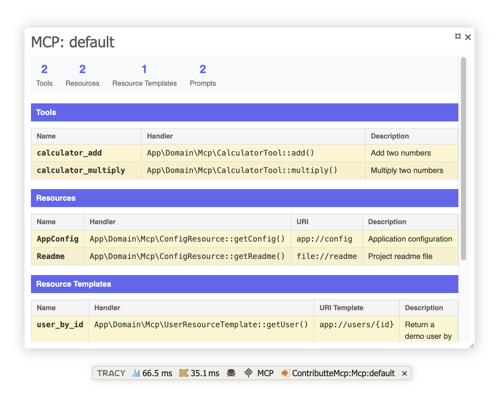

# Contributte MCP

Integration of [Model Context Protocol (MCP)](https://modelcontextprotocol.io) for Nette Framework.

## Content

- [Installation](#installation)
- [Configuration](#configuration)
  - [Minimal configuration](#minimal-configuration)
  - [Advanced configuration](#advanced-configuration)
  - [Server configuration](#server-configuration)
  - [Discovery](#discovery)
  - [Session management](#session-management)
  - [Container integration](#container-integration)
  - [Transport factories](#transport-factories)
  - [Custom transport factories](#custom-transport-factories)
- [Tools, Resources, and Prompts](#tools-resources-and-prompts)
- [Usage](#usage)
  - [Basic usage](#basic-usage)
- [Debugging](#debugging)
- [Examples](#examples)

## Installation

Install package using composer.

```bash
composer require contributte/mcp
```

Register prepared [compiler extension](https://doc.nette.org/en/dependency-injection/nette-container) in your `config.neon` file.

```neon
extensions:
  mcp: Contributte\Mcp\DI\McpExtension
```

## Configuration

### Minimal configuration

The simplest configuration requires only a server name:

```neon
mcp:
  servers:
    default:
      name: My MCP Server
      version: 1.0.0
```

### Advanced configuration

Here is the list of all available configuration options:

```neon
mcp:
  servers:
    <server-name>:
      # Server information
      name: <string>                    # Server name (default: 'MCP')
      version: <string>                 # Server version (default: '1.0.0')

      # Discovery configuration
      discovery:
        enabled: <bool>                 # Enable auto-discovery (default: true)
        basePath: <string>              # Base path for discovery (default: %appDir%)
        scanDirs: <array<string>>       # Directories to scan relative to basePath (default: ['.'])
        excludeDirs: <array<string>>    # Directories to exclude (default: [])
        cache: <service|null>           # PSR-16 cache service for discovery results

      # Session configuration
      session:
        type: <'file'|'inmemory'|'psr16'>  # Session type (default: 'file' if %tempDir% exists, otherwise 'inmemory')
        path: <string|null>                # Path for file sessions
        ttl: <int>                         # Time to live in seconds (default: 3600)
        prefix: <string>                   # Session key prefix (default: 'mcp-')
        cache: <service|null>              # PSR-16 cache service for sessions

      # Container integration
      container: <service|class-name|null>    # PSR-11 container implementation (default: NetteContainer adapter)
```

### Server configuration

Each server configuration defines an MCP server instance. You can define multiple servers with different names:

```neon
mcp:
  servers:
    default:
      name: Main MCP Server
      version: 1.0.0

    secondary:
      name: Secondary MCP Server
      version: 2.0.0
```

Use `McpManager` to get server factories:

```php
use Contributte\Mcp\McpManager;

class MyService
{
    public function __construct(
        private McpManager $mcpManager
    ) {
    }

    public function doMagic(): void
    {
        $server = $this->mcpManager
            ->getServerFactory('secondary')
            ->create();

        // Do something with server
    }
}
```

### Discovery

Discovery is **enabled by default** and automatically scans your application for MCP tools, resources, and prompts using PHP attributes.

```neon
mcp:
  servers:
    default:
      name: My MCP Server
      version: 1.0.0
      discovery:
        enabled: true           # Default: true
        basePath: %appDir%      # Default: %appDir%
        scanDirs:
          - src/Mcp             # Directories relative to basePath
        excludeDirs:
          - vendor
          - tests
        cache: @cacheService    # Optional: PSR-16 cache for discovery results
```

The discovery mechanism scans PHP files in the specified directories and automatically registers classes with MCP attributes (`#[McpTool]`, `#[McpResource]`, `#[McpPrompt]`, `#[McpResourceTemplate]`).

> [!TIP]
> Use a PSR-16 cache service to improve performance in production environments, as discovery scanning can be expensive.

### Session management

MCP servers can maintain session state. Three session types are supported:

**File-based sessions** (default):

```neon
mcp:
  servers:
    default:
      session:
        type: file
        path: %tempDir%/mcp-sessions
        ttl: 3600
```

**In-memory sessions**:

```neon
mcp:
  servers:
    default:
      session:
        type: inmemory
        ttl: 3600
```

**PSR-16 cache sessions**:

```neon
mcp:
  servers:
    default:
      session:
        type: psr16
        cache: @psr16CacheService
        ttl: 3600
        prefix: mcp-
```

> [!NOTE]
> The `prefix` option only applies to PSR-16 cache sessions. It is ignored for file-based and in-memory sessions.

### Container integration

The extension automatically provides a `NetteContainer` adapter out-of-the-box, which enables dependency injection in MCP tools using the Nette DI container. No configuration is required.

If you need to use a custom PSR-11 container implementation instead, you can override it:

```neon
mcp:
  servers:
    default:
      container: @myContainerService
```

### Transport factories

The extension registers two transport factories by default:

1. **`stdio`** - STDIN/STDOUT transport for command-line usage
2. **`streamable`** - HTTP streamable transport for web requests

```php
// Get stdio transport factory
$stdioFactory = $mcpManager->getTransportFactory('stdio');

// Get streamable transport factory
$streamableFactory = $mcpManager->getTransportFactory('streamable');
```

### Custom transport factories

You can create custom transport factories by implementing `TransportFactoryInterface`:

```php
<?php declare(strict_types=1);

namespace App\Mcp;

use Contributte\Mcp\Http\TransportFactoryInterface;
use Mcp\Server\Transport\TransportInterface;

final class CustomTransportFactory implements TransportFactoryInterface
{

    public function create(mixed ...$args): TransportInterface
    {
        return new MyCustomTransport();
    }

}
```

Register it in your configuration:

```neon
services:
  mcp.transport.custom.factory:
    factory: App\Mcp\CustomTransportFactory
    tags: [contributte.mcp.transport_factory: custom]

# Now you can use it
# $factory = $mcpManager->getTransportFactory('custom');
```

## Tools, Resources, and Prompts

MCP capabilities (tools, resources, prompts) are **automatically discovered** using PHP attributes. There is no manual configuration needed - just create classes with the appropriate attributes and they will be registered automatically.

### Tools

Tools are methods that can be called by MCP clients. Use the `#[McpTool]` attribute:

```php
<?php declare(strict_types=1);

namespace App\Mcp;

use Mcp\Capability\Attribute\McpTool;

final class CalculatorTool
{
    #[McpTool(name: 'calculator_add', description: 'Add two numbers')]
    public function add(int $a, int $b): int
    {
        return $a + $b;
    }

    #[McpTool(name: 'calculator_multiply', description: 'Multiply two numbers')]
    public function multiply(int $a, int $b): int
    {
        return $a * $b;
    }
}
```

You can also use the attribute on a class with an `__invoke` method:

```php
<?php declare(strict_types=1);

namespace App\Mcp;

use Mcp\Capability\Attribute\McpTool;

#[McpTool(name: 'weather', description: 'Get current weather for a location')]
final class WeatherTool
{
    public function __invoke(string $location): array
    {
        // Fetch weather data...
        return ['temperature' => 22, 'condition' => 'sunny'];
    }
}
```

### Resources

Resources provide data that MCP clients can read. Use the `#[McpResource]` attribute:

```php
<?php declare(strict_types=1);

namespace App\Mcp;

use Mcp\Capability\Attribute\McpResource;

final class ConfigResource
{
    #[McpResource(uri: 'app://config', name: 'App Config', description: 'Application configuration')]
    public function getConfig(): string
    {
        return json_encode(['version' => '1.0.0', 'env' => 'production']);
    }

    #[McpResource(uri: 'file://readme', name: 'Readme', description: 'Project readme file', mimeType: 'text/markdown')]
    public function getReadme(): string
    {
        return file_get_contents(__DIR__ . '/../../README.md');
    }
}
```

### Resource Templates

Resource templates define URI patterns with placeholders. Use the `#[McpResourceTemplate]` attribute:

```php
<?php declare(strict_types=1);

namespace App\Mcp;

use Mcp\Capability\Attribute\McpResourceTemplate;

final class UserResource
{
    #[McpResourceTemplate(uriTemplate: 'user://{id}', name: 'User', description: 'Get user by ID')]
    public function getUser(string $id): string
    {
        $user = $this->userRepository->find($id);
        return json_encode($user);
    }
}
```

### Prompts

Prompts are predefined templates that MCP clients can use. Use the `#[McpPrompt]` attribute:

```php
<?php declare(strict_types=1);

namespace App\Mcp;

use Mcp\Capability\Attribute\McpPrompt;

final class CodePrompts
{
    #[McpPrompt(name: 'code_review', description: 'Review code for best practices')]
    public function codeReview(string $code, string $language): string
    {
        return "Please review this {$language} code for best practices:\n\n```{$language}\n{$code}\n```";
    }

    #[McpPrompt(name: 'explain_code', description: 'Explain what code does')]
    public function explainCode(string $code): string
    {
        return "Please explain what this code does:\n\n```\n{$code}\n```";
    }
}
```

### Dependency Injection

All discovered MCP classes support dependency injection through the Nette DI container:

```php
<?php declare(strict_types=1);

namespace App\Mcp;

use App\Model\UserRepository;
use Mcp\Capability\Attribute\McpTool;

final class UserTool
{
    public function __construct(
        private UserRepository $userRepository
    ) {
    }

    #[McpTool(name: 'find_user', description: 'Find user by email')]
    public function findByEmail(string $email): array
    {
        $user = $this->userRepository->findByEmail($email);
        return $user ? $user->toArray() : [];
    }
}
```

## Usage

### Basic usage

After configuration, you can use the MCP server in your application:

#### Using in Nette Presenter

```php
<?php declare(strict_types=1);

namespace App\Presenters;

use Contributte\Mcp\Http\GuzzleBridge;
use Contributte\Mcp\McpManager;
use Nette\Application\IPresenter;
use Nette\Application\Request as AppRequest;
use Nette\Application\Response;
use Nette\Http\IRequest;
use Psr\Http\Message\ResponseInterface;

class McpPresenter implements IPresenter
{

    public function __construct(
        protected IRequest $httpRequest,
        protected McpManager $mcpManager,
    )
    {
    }

    public function run(AppRequest $appRequest): Response
    {
        // Get server name from route parameters
        $serverName = $appRequest->getParameter('server');
        $serverName = is_string($serverName) ? $serverName : 'default';

        // Convert Nette request to PSR-7 request
        $serverRequest = GuzzleBridge::fromNette($this->httpRequest);

        // Create server and transport
        $server = $this->mcpManager->getServerFactory($serverName)->create();
        $transport = $this->mcpManager->getTransportFactory('streamable')->create($serverRequest);

        // Run server
        $psr7Response = $server->run($transport);
        assert($psr7Response instanceof ResponseInterface);

        return GuzzleBridge::toNette($psr7Response);
    }

}
```

#### Using in PSR-7 Controller

```php
<?php declare(strict_types=1);

use Contributte\Mcp\McpManager;
use Psr\Http\Message\ResponseInterface;
use Psr\Http\Message\ServerRequestInterface;

class McpController
{
    public function __construct(
        private readonly McpManager $mcpManager
    ) {
    }

    public function __invoke(ServerRequestInterface $serverRequest): ResponseInterface
    {
        $server = $this->mcpManager->getServerFactory('default')->create();
        $transport = $this->mcpManager->getTransportFactory('streamable')->create($serverRequest);

        $response = $server->run($transport);

        return $response;
    }
}
```

## Debugging

When Tracy debugger is enabled, a debug panel is automatically registered showing all registered tools, resources, resource templates, and prompts along with their handlers.

To inspect the MCP server configuration without processing actual MCP requests, add the `?debug=1` query parameter to your MCP endpoint URL:

```
https://your-app.com/mcp?debug=1
```

This will return a simple text response and allow you to inspect the Tracy debug bar to see:
- Number of registered tools, resources, templates, and prompts
- Handler class and method for each registered item (e.g., `App\Mcp\CalculatorTool::add()`)
- Tool descriptions and input schemas
- Resource URIs and MIME types
- Prompt arguments



## Examples

### Example 1: Basic MCP Server

```neon
# config.neon
extensions:
  mcp: Contributte\Mcp\DI\McpExtension

mcp:
  servers:
    default:
      name: My Application MCP Server
      version: 1.0.0
      discovery:
        scanDirs:
          - src/Mcp
```

```php
<?php declare(strict_types=1);

// src/Mcp/CalculatorTool.php
namespace App\Mcp;

use Mcp\Capability\Attribute\McpTool;

final class CalculatorTool
{
    #[McpTool(description: 'Add two numbers')]
    public function add(int $a, int $b): int
    {
        return $a + $b;
    }

    #[McpTool(name: 'multiply', description: 'Multiply two numbers')]
    public function multiplyNumbers(int $a, int $b): int
    {
        return $a * $b;
    }
}
```

### Example 2: Multiple Servers with Different Scan Directories

```neon
mcp:
  servers:
    public:
      name: Public MCP Server
      version: 1.0.0
      discovery:
        scanDirs:
          - src/Mcp/Public

    internal:
      name: Internal MCP Server
      version: 1.0.0
      discovery:
        scanDirs:
          - src/Mcp/Internal
```

### Example 3: Using in Nette Presenter

```php
<?php declare(strict_types=1);

namespace App\Presenters;

use Contributte\Mcp\Http\GuzzleBridge;
use Contributte\Mcp\McpManager;
use Nette\Application\IPresenter;
use Nette\Application\Request as AppRequest;
use Nette\Application\Response;
use Nette\Http\IRequest;
use Psr\Http\Message\ResponseInterface;

class McpPresenter implements IPresenter
{

    public function __construct(
        protected IRequest $httpRequest,
        protected McpManager $mcpManager,
    )
    {
    }

    public function run(AppRequest $appRequest): Response
    {
        // Get server name from route parameters
        $serverName = $appRequest->getParameter('server');
        $serverName = is_string($serverName) ? $serverName : 'default';

        // Convert Nette request to PSR-7 request
        $serverRequest = GuzzleBridge::fromNette($this->httpRequest);

        // Create server and transport
        $server = $this->mcpManager->getServerFactory($serverName)->create();
        $transport = $this->mcpManager->getTransportFactory('streamable')->create($serverRequest);

        // Run server
        $psr7Response = $server->run($transport);
        assert($psr7Response instanceof ResponseInterface);

        return GuzzleBridge::toNette($psr7Response);
    }

}
```

### Example 4: Using in PSR-7 Controller

```php
<?php declare(strict_types=1);

namespace App\Controllers;

use Contributte\Mcp\McpManager;
use Psr\Http\Message\ResponseInterface;
use Psr\Http\Message\ServerRequestInterface;

final class McpController
{
    public function __construct(
        private readonly McpManager $mcpManager
    ) {
    }

    public function handle(ServerRequestInterface $request): ResponseInterface
    {
        // Create server and transport
        $server = $this->mcpManager->getServerFactory('default')->create();
        $transport = $this->mcpManager->getTransportFactory('streamable')->create($request);

        // Run server and return PSR-7 response
        return $server->run($transport);
    }
}
```

### Example 5: Pure PHP CLI Script

Create a standalone `mcp.php` script:

```php
#!/usr/bin/env php
<?php declare(strict_types=1);

require __DIR__ . '/vendor/autoload.php';

use Contributte\Mcp\McpManager;

$container = require __DIR__ . '/app/bootstrap.php';

/** @var McpManager $mcpManager */
$mcpManager = $container->getByType(McpManager::class);

// Create server
$server = $mcpManager->getServerFactory('default')->create();

// Create stdio transport
$transport = $mcpManager->getTransportFactory('stdio')->create();

// Run server
$server->run($transport);
```

Make it executable:

```bash
chmod +x mcp.php
```

Run it:

```bash
./mcp.php
```

### Example 6: Symfony Console Command

The package provides a built-in Symfony console command `Contributte\Mcp\Console\McpCommand` for running MCP servers.

Register it in your console configuration (if using [contributte/console](https://github.com/contributte/console)):

```neon
services:
  - Contributte\Mcp\Console\McpCommand
```

Run the command:

```bash
php bin/console mcp:server --server=default
```

Or specify a different server:

```bash
php bin/console mcp:server --server=secondary
```

> [!TIP]
> For more information about MCP, visit the [official MCP documentation](https://modelcontextprotocol.io).
>
> For information about the underlying PHP SDK, see the [MCP PHP SDK documentation](https://github.com/modelcontextprotocol/php-sdk).
